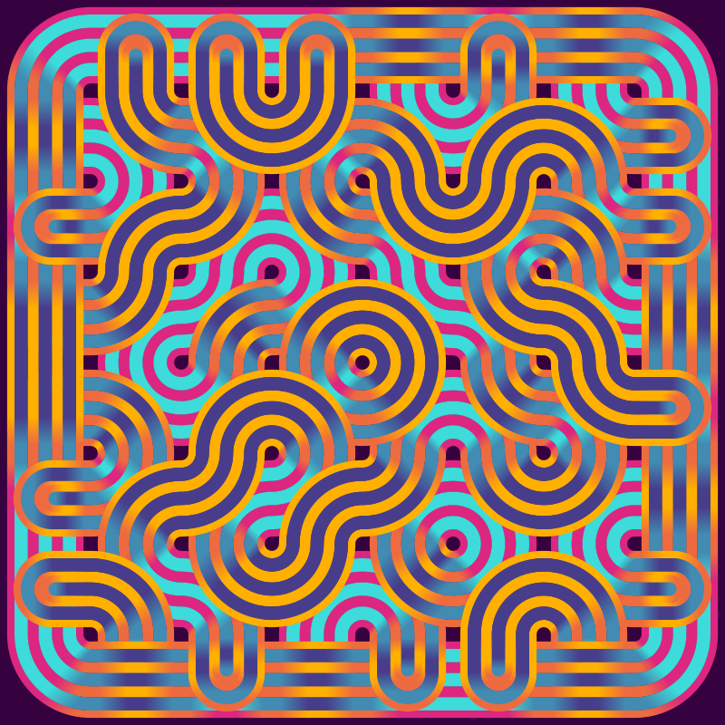
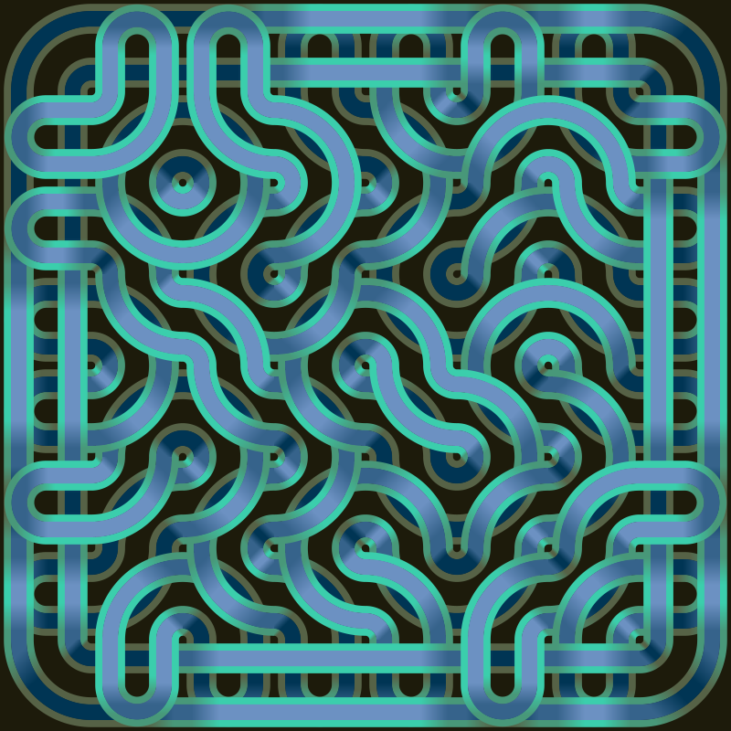

# truchet_tiler

A rough-and-ready R Shiny app for generating arrays of truchet tiles.

This is a GUI for an art project I got fixated on at the end of 2024 and beginning of 2025. I built it to make it easier to quickly iterate on the parameters in order to get an array I liked. Because it does as much as I need it to, I'm not planning on supporting it, but I figured it might be interesting to someone else besides me.

The tool is hosted [here](https://terminal-index.shinyapps.io/truchet-tiler/).

## Getting it running yourself
The easiest way to run this app on your local machine is:
1) Install R and RStudio
2) Install the packages shiny, tidyverse, and colourpicker
3) Clone this repo and make a new R project in the folder using RStudio
4) Open app.R in RStudio and click the "run app" button at the top of the script pane
